<div align="center">


# 🏛️ CleanState AI — Statewide Civic Cleanliness & Municipal Waste Intelligence Platform

### *Transforming civic waste management into an AI-powered, state-level municipal intelligence ecosystem*

[](https://react.dev)
[](https://vitejs.dev)
[](https://nodejs.org)
[](https://postgresql.org)
[](https://aistudio.google.com)
[](https://leafletjs.com)
[](LICENSE)
[](CONTRIBUTING.md)

<br/>

> **CleanState AI** is an enterprise-grade full-stack civic intelligence platform expanding across Telangana and municipal urban local bodies (ULBs). Empowering citizens to report civic garbage in real time using AI-powered classification, automated reverse-geocoding (State, District, Municipality, Ward), spatial-temporal anti-fraud protection, Swachh benchmark rankings, municipal tax rebate rewards, and dynamic GIS district heatmaps.

<br/>

[🚀 Live Demo](#) · [📸 Screenshots](#-screenshots) · [🛠️ Setup](#-getting-started) · [📖 Docs](#-api-documentation) · [🤝 Contribute](#-contributing)

---

</div>

## 📋 Table of Contents

- [✨ Features Overview](#-features-overview)
- [🤖 AI Intelligence System](#-ai-intelligence-system)
- [🗺️ Smart Map System](#️-smart-map-system)
- [🏆 Gamification & Rewards](#-gamification--rewards)
- [📍 Zone Radius Intelligence](#-zone-radius-intelligence)
- [👷 Coordinator System](#-coordinator-system)
- [🔔 Notification System](#-notification-system)
- [🔐 Authentication System](#-authentication-system)
- [🏗️ System Architecture](#️-system-architecture)
- [🗄️ Database ER Diagram](#️-database-er-diagram)
- [📱 Mobile First Design](#-mobile-first-design)
- [🛠️ Tech Stack](#️-tech-stack)
- [🚀 Getting Started](#-getting-started)
- [📁 Project Structure](#-project-structure)
- [📖 API Documentation](#-api-documentation)
- [🧪 Testing](#-testing)
- [🤝 Contributing](#-contributing)
- [👥 Team](#-team)

---

## ✨ Features Overview

<table>
<tr>
<td width="33%">

### 🎯 For Students
- 📸 **Real-time camera capture**
- 🤖 **AI waste classification**
- 📍 **GPS location verification**
- 🗺️ **Live campus map**
- 🏆 **Points, badges & leaderboard**
- 🔔 **Smart notifications**
- 📱 **Mobile-first design**

</td>
<td width="33%">

### 👷 For Coordinators
- 📋 **Assigned task dashboard**
- 📷 **Before/After verification**
- 📍 **GPS-locked resolutions**
- ✅ **One-tap issue closing**
- 📢 **Zone announcements**
- 🔔 **Real-time alerts**
- 🚀 **Streamlined workflows**

</td>
<td width="34%">

### 🛡️ For Admins
- 📊 **Real-time heatmap**
- 🗂️ **Global report management**
- 🔥 **AI severity scoring (1–10)**
- 📈 **Weekly Gemini AI analysis**
- 🏅 **Zone & staff management**
- 📷 **Photo evidence archive**
- 🔐 **Secure staff portal**

</td>
</tr>
</table>

---

## 📸 Interface Screenshots

### 🎓 Student Interface

<div align="center">
  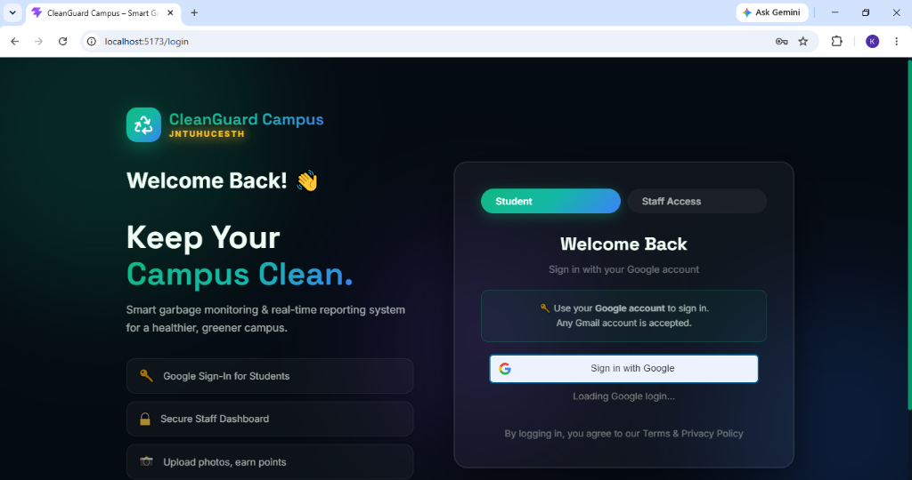
  <br/>
  <em>Secure Login for Students and Staff</em>
  <br/><br/>
  
  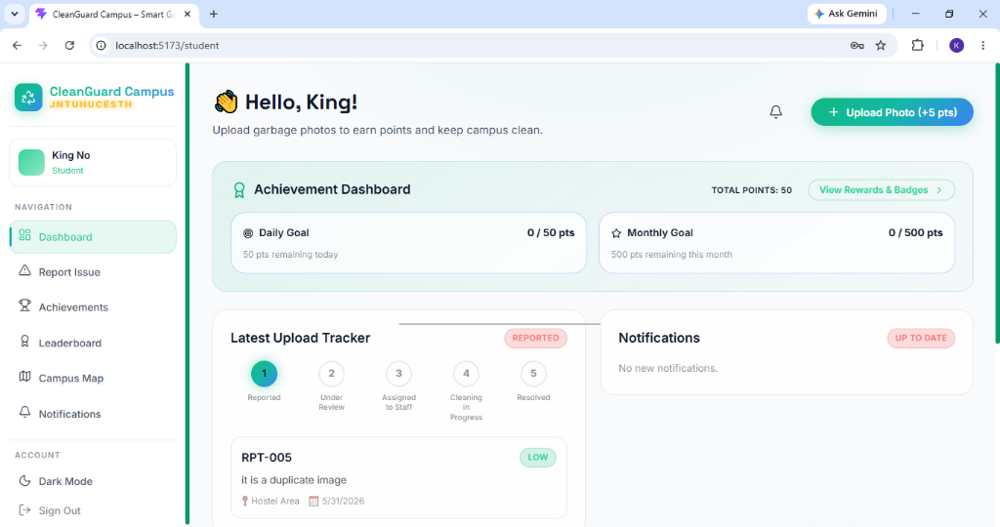
  <br/>
  <em>Student Dashboard showing goals, achievements, and notifications</em>
  <br/><br/>
  
  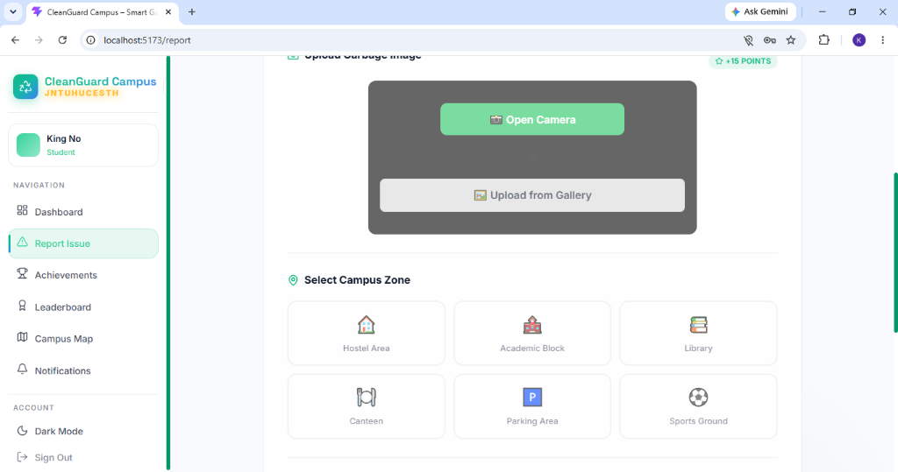
  <br/>
  <em>Live Camera Capture & Image Upload for Reporting</em>
  <br/><br/>
  
  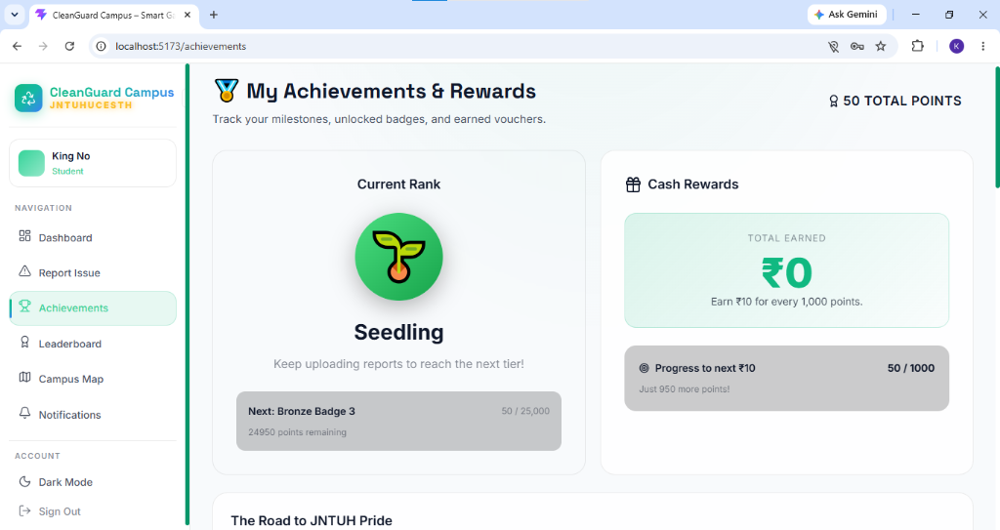
  <br/>
  <em>Milestones, Badges, and Rewards Tracking</em>
  <br/><br/>
  
  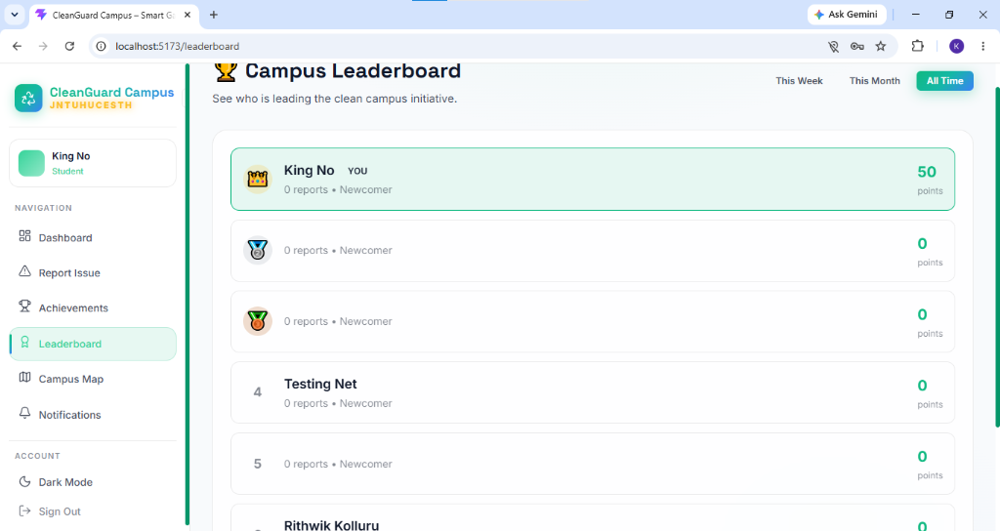
  <br/>
  <em>Competitive Campus Leaderboard System</em>
</div>

---

### 🛡️ Admin Interface

<div align="center">
  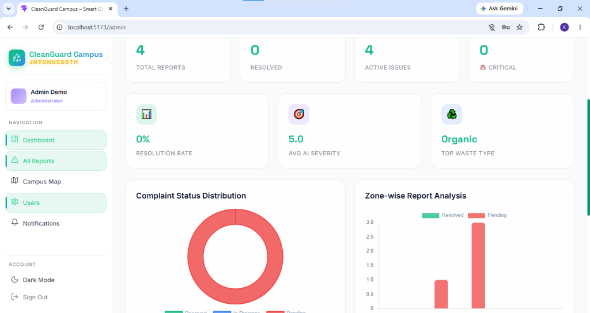
  <br/>
  <em>Admin Dashboard with real-time statistics and zone analysis</em>
  <br/><br/>
  
  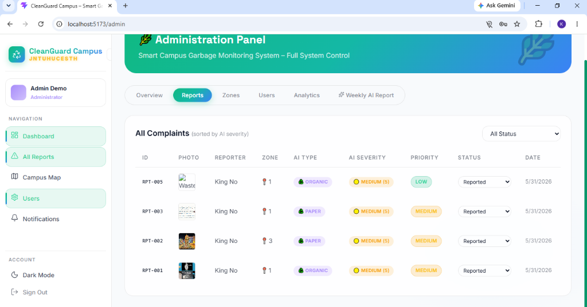
  <br/>
  <em>Comprehensive Reports Management with AI Severity Sorting</em>
  <br/><br/>
  
  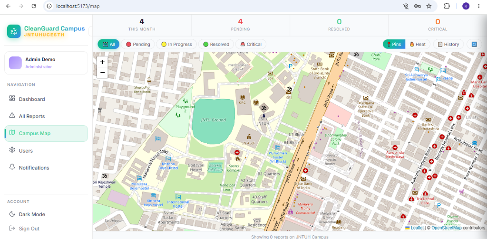
  <br/>
  <em>Live Interactive Campus Map for Admins and Coordinators</em>
  <br/><br/>

  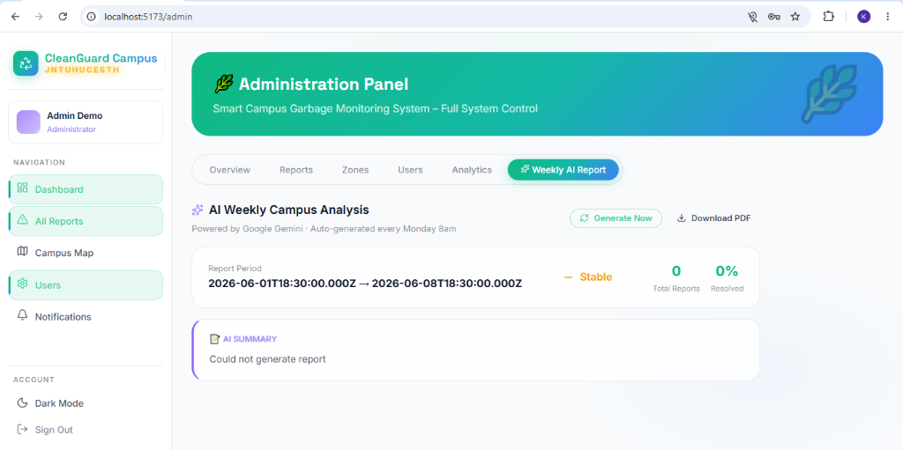
  <br/>
  <em>Automated Weekly Campus Analysis Generated by Gemini AI</em>
</div>

---

### 👷 Coordinator Interface

<div align="center">
  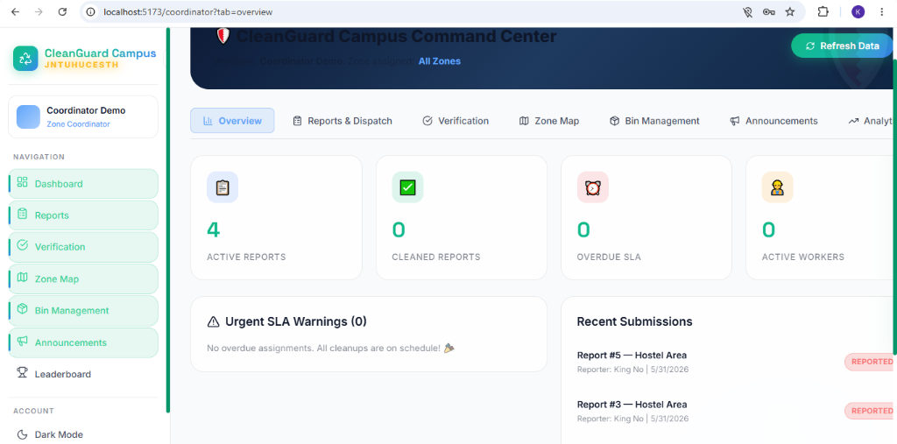
  <br/>
  <em>Command Center Overview showing active tasks and SLA warnings</em>
  <br/><br/>
  
  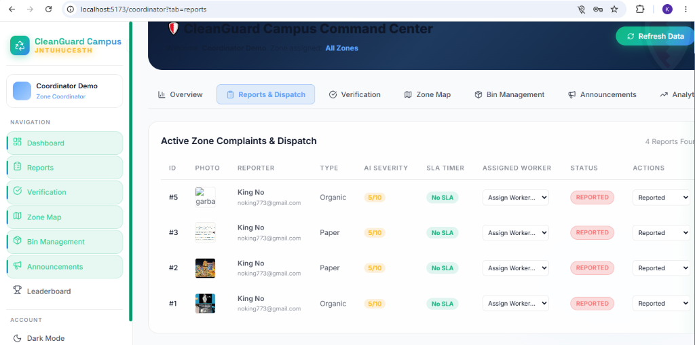
  <br/>
  <em>Zone Complaint Dispatch and Worker Assignment</em>
  <br/><br/>
  
  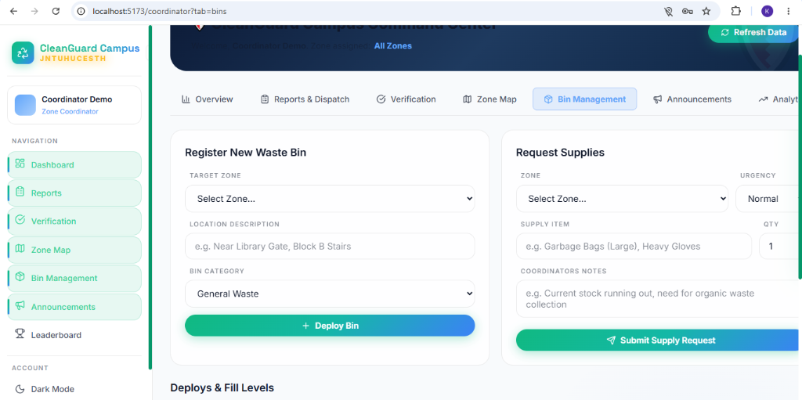
  <br/>
  <em>Register New Bins and Request Supplies</em>
  <br/><br/>

  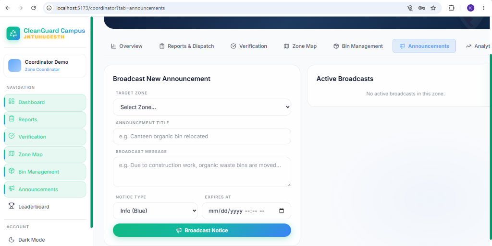
  <br/>
  <em>Broadcast Announcements to Specific Campus Zones</em>
  <br/><br/>

  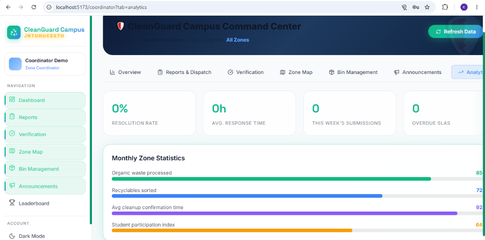
  <br/>
  <em>Monthly Zone Statistics and Resolution Analytics</em>
</div>

---

## 🤖 AI Intelligence System

> Powered by **Google Gemini 2.5 Flash** — the most advanced free-tier AI model

### 1. 🗑️ Smart Waste Classifier

When a student takes a photo, Gemini AI instantly analyses it and returns:

```
📷 Photo Uploaded
        ↓
🔍 Gemini 2.5 Flash analyses image
        ↓
┌─────────────────────────────────┐
│  ♻️  PLASTIC / RECYCLABLE       │
│  Bin Color:  🔵 BLUE            │
│  Confidence: 87%                │
│  Tip: Rinse before recycling    │
└─────────────────────────────────┘
        ↓
✅ Waste type auto-filled in form
```

**Supported waste categories:**

| Category     | Bin Color   | Examples |
|--------------|-------------|---------|
| ♻️ Plastic   | 🔵 Blue    | Bottles, bags, wrappers |
| 🍃 Organic   | 🟢 Green   | Food waste, leaves |
| ⚡ E-waste   | 🔴 Red     | Batteries, cables, phones |
| 📄 Paper     | 🟡 Yellow  | Newspapers, cardboard |
| 🔩 Metal     | ⚪ Grey    | Cans, foil, wires |
| 🫙 Glass      | 🟠 Orange  | Bottles, jars |
| ☢️ Hazardous | 🟣 Purple  | Chemicals, paint |
| 🗑️ General   | ⚫ Black   | Mixed/unidentifiable |

---

### 2. 🔍 Fake Photo & Duplicate Detection

Prevents point farming by automatically detecting invalid submissions:

```
Student uploads photo
        ↓
Gemini checks: "Is this actually waste?"
        ↓
┌─────────────────┬──────────────────────────────┐
│ Selfie uploaded │ ❌ Blocked — "Please upload  │
│                 │    an actual waste photo"    │
├─────────────────┼──────────────────────────────┤
│ Random object   │ ❌ Blocked — No points       │
├─────────────────┼──────────────────────────────┤
│ Duplicate area  │ ⚠️ Warning shown — Can submit│
│ (same zone)     │    but reduced points        │
├─────────────────┼──────────────────────────────┤
│ Real waste photo│ ✅ Accepted — Full points    │
└─────────────────┴──────────────────────────────┘
```

---

### 3. 📊 AI Severity Scoring

Every report gets automatically scored 1–10 by Gemini:

| Score | Priority        | Badge            | Meaning                  |
|-------|-----------------|------------------|--------------------------|
| 9–10 | 🚨 Critical      | Red (Large pin)  | Health hazard, huge area |
| 7–8  | 🔴 High          | Red pin          | Large overflow, urgent   |
| 5–6  | 🟡 Medium        | Orange pin       | Moderate mess            |
| 3–4  | 🟢 Low           | Yellow pin       | Small pile               |
| 1–2  | ⚪ Minimal       | Small pin        | Single wrapper           |

---

### 4. 📈 Weekly AI Campus Report

Every Monday at 8:00 AM, Gemini generates a full campus waste analysis:

```json
{
  "summary": "Plastic waste increased 34% near Block C this week...",
  "topProblematicAreas": ["Block C Entrance", "Canteen Area", "Parking Lot"],
  "mostCommonWasteType": "Plastic",
  "trend": "Worsening",
  "recommendations": [
    "Add 2 recycling bins near Block C",
    "Student awareness drive for canteen",
    "Daily monitoring of parking area"
  ],
  "resolvedPercentage": 67,
  "studentEngagement": "142 students actively reporting this week"
}
```

---

## 🗺️ Smart Map System

> Built with **Leaflet.js + OpenStreetMap** — completely free, no billing required

### Campus Map Features

```
┌─────────────────────────────────────────────────────----------------|
│  📊 32 Reports │ 🔴 8 Pending │ ✅ 21 Resolved │ 🚨 3 Critical    │
├─────────────────────────────────────────────────────----------------┤
│  [🗺️ All] [🔴 Pending] [🟡 Progress] [🟢 Resolved] [🚨 Critical]  │
│                          [📍 Pins] [🔥 Heat]  [📋 History] [🔄]     │
├─────────────────────────────────────────────────────----------------┤
│                                                                     │
│           🔴(big)                                                   │
│      🟡        🟢                                                  │
│           📍(you)    🔴                                             │
│    🟢                    🟡                                        │
│                  🔴(big)                                            │
│                                                                     │
│  ← JNTUH Campus Map (OpenStreetMap) →                               │
├────────────────────────────────────────────────────-----------------|
│  Showing 32 reports on JNTUH Campus                                 │
└─────────────────────────────────────────────────────----------------┘
```

### Pin Color Legend

| Pin | Status | Size |
|-----|--------|------|
| 🔴 Red (Large) | Critical — Severity 8+ | 38px |
| 🔴 Red | Pending — High severity | 32px |
| 🟠 Orange | Pending — Normal | 32px |
| 🟡 Yellow | Low severity | 32px |
| 🔵 Blue | In Progress | 32px |
| 🟢 Green | Resolved | 32px |
| 🔵 Pulsing dot | Your location | — |

### Click Any Pin → See Full Details

```
┌──────────────────────────────┐
│ [Photo thumbnail]            │
│ ♻️ PLASTIC    ⏳ Pending     │
│                              │
│ Overflowing bin near stairs  │
│                              │
│ 📍 Block C Entrance           │
│ ⚠️ Severity: 7/10 — 🔴 High │
│ 👤 Rithwik K                 │
│ 🕐 2h ago                    │
│                              │
│ 🚨 Needs immediate attention │
└──────────────────────────────┘
```

### 🔥 Admin Heatmap

Toggle from pins to heatmap view — areas with more reports appear darker:

```
🔵 Blue    = Low activity (1–2 reports)
🟢 Green   = Moderate (3–5 reports)
🟡 Yellow  = Active (6–10 reports)
🟠 Orange  = High (11–15 reports)
🔴 Red     = Critical hotspot (15+ reports)
```

### 📋 History Panel

Slide-in panel (right on desktop, bottom sheet on mobile):
- Toggle: **All Reports** / **My Reports**
- Thumbnail + waste type + location + time
- Tap any item → map flies to that location

---

## 🏆 Gamification & Rewards

> Students earn points for every action — creating a competitive, engaged community

### Points System

| Action             | Points          | Conditions |
|--------------------|-----------------|------------|
| 📋 Submit report   | +10 pts         | Always awarded |
| 📷 Upload photo    | +5 pts          | With report |
| ✅ Report verified | +15 pts         | Admin/Coordinator marks resolved |
| 🎉 Zone bonus      | +20 pts         | Area cleaned by staff |
| 📅 Daily limit     | 50 pts          | Max per day |
| 📆 Monthly limit   | 500 pts         | Max per month |

### Zone-Based Point Scaling

| Reports in 50m zone | Points awarded | Message shown |
|--------------------|----------------|---------------|
| 1–5 reports | 100% (full) | Normal submission |
| 6–10 reports | 100% + warning | "X people already reported" |
| 11–15 reports | 50% (half) | "Area heavily reported" |
| 16+ reports | 0% (none) | "Being handled — still saves!" |
| After resolved | Resets to 100% | Zone reopened |

### 🏅 Badge System

```
🌱 Newcomer    →   0 – 49 points
🥉 Contributor →  50 – 199 points
🥈 Active      → 200 – 499 points
🥇 Expert      → 500 – 999 points
🏆 Champion    → 1000+ points
```

### 🥇 Leaderboard Page

```
┌─────────────────────────────────────────────┐
│  👤 Rithwik K   🥉 Contributor   Rank: #4  │
│  This Week: 45pts  Reports: 12  Zones: 3    │
├─────────────────────────────────────────────┤
│  [📅 This Week] [📆 This Month] [All Time] │
├────────────────────────────────────────────-┤
│         🥈              👑           🥉   │
│      [Avatar]        [Avatar]      [Avatar]│
│         🥈              🥇           🥉   │
│       Arun K           Priya S       Dev R  │
│       890 pts         1240 pts       750 pts│
│    ████████        ████████████    ██████   │
├─────────────────────────────────────────────┤
│  4  🥉  [Avatar]  Rithwik K  🥉 Active     │
│                              385 pts  📋12  │
│  5  [Avatar]  Sneha M  🥈 Active            │
│                              310 pts  📋9   │
└─────────────────────────────────────────────┘
```

---

## 📍 Zone Radius Intelligence

> A smart system that prevents spam, manages crowded areas, and rewards community action

### How Zones Work

```
Campus divided into 50m × 50m grid squares
Each square = one Zone with unique Zone ID

Zone ID format: zone_17.4920_78.3910

When student submits:
1. GPS coordinates → calculate Zone ID
2. Check zone's current report count
3. Apply points multiplier
4. Update zone counter
5. Notify existing reporters if threshold hit
```

### Zone Lifecycle

```
[Empty Zone]
     ↓ first report
[Active Zone — 1 report, full points]
     ↓ 5 reports
[Warning Zone — still full points, others warned]
     ↓ 10 reports
[Busy Zone — half points, heavily reported]
     ↓ 15 reports
[Saturated Zone — 0 points, still accepts photos]
     ↓ Coordinator resolves area with photo proof
[Cleaned! +20 bonus to ALL reporters]
     ↓
[Zone Reset — accepts new reports at full points]
```

### Zone Challenge Bonus

When admin or coordinator cleans a zone — **every student who reported** gets:
- +20 bonus points automatically
- 🎉 "Zone Cleaned!" notification
- Contribution tracked in leaderboard stats

---

## 👷 Coordinator System

> A dedicated workflow for campus staff who physically verify and clean reported waste.

### Verification Workflow

```
Coordinator sees "Pending" report in their zone
        ↓
Navigates to physical location via Map
        ↓
Cleans the waste area
        ↓
Takes a **verification photo** of the clean area
        ↓
System stores the before/after proof
        ↓
Report marked "Resolved" & Zone Bonus triggered for students
```

**Features for Coordinators:**
- 📸 **Verification Camera** — Takes mandatory proof photos of cleaned areas.
- 📋 **Coordinator Dashboard** — View all pending reports assigned to their specific campus zones.
- 🏆 **Trigger Rewards** — Their resolution automatically distributes bonus points to all students who reported that zone.
- 📢 **Zone Announcements** — Ability to broadcast messages to students who try to report in their zone (e.g. "Maintenance scheduled for tomorrow").

---

## 🔔 Notification System

> Real-time alerts via polling — completely free, no WebSocket server needed

### Notification Types

| Type               | Icon | When Triggered |
|--------------------|------|----------------|
| Zone Resolved      | 🎉 | Your reported area was cleaned |
| Zone Busy          | 📍  | 5+ people reported same area |
| Report In Progress | 🔧 | Admin starts working on report |
| Area Cleaned       | ✅ | Report marked resolved |
| Daily Limit        | 🏆 | 50 points earned today |
| Weekly Summary     | 📊 | Every Monday morning |

### Notification Bell

```
🔔(3)  ← Red badge shows unread count
  ↓ Click
┌─────────────────────────────┐
│ Notifications    Mark all   │
├─────────────────────────────┤
│ 🎉 Zone Cleaned!            │
│ Area you reported cleaned!  │
│ +20 bonus points 🌱  2h ago │
│ ● (unread dot)              │
├─────────────────────────────┤
│ 🔧 Report In Progress       │
│ Staff working on Block C    │
│ 5h ago                      │
├─────────────────────────────┤
│ 📊 Weekly Summary           │
│ 45pts this week, Rank #4    │
│ Yesterday                   │
└─────────────────────────────┘
```

---

## 🔐 Authentication System

> Two separate secure login flows — students via Google, staff via credentials

### Student Login — Google OAuth 2.0

```
Student clicks "Sign in with Google"
        ↓
Google One-Tap account picker appears
        ↓
Student selects their Google account
        ↓
Google returns ID token to frontend
        ↓
Backend verifies token with Google API
        ↓
Find or create student in PostgreSQL
        ↓
Return JWT token → Student Dashboard
```

**Security features:**
- ✅ No passwords stored ever
- ✅ Token verified server-side via `google-auth-library`
- ✅ JWT expires in 24 hours
- ✅ Student profile picture synced from Google
- ✅ One-click login on return visits

### Staff Login — Email + Password

```
Admin or Coordinator enters credentials
        ↓
Backend checks role ('admin' or 'coordinator')
        ↓
Bcrypt password verification
        ↓
JWT token with role claim
        ↓
Admin/Coordinator Dashboard (students cannot access)
```

### Role-Based Access Control

| Route                 | Student | Admin | Coordinator |
|-----------------------|---------|-------|-------------|
| `/student/*`                 | ✅ | ❌ | ❌ |
| `/admin/*`                   | ❌ | ✅ | ❌ |
| `/coordinator/*`             | ❌ | ❌ | ✅ |
| `/api/reports` (POST)        | ✅ | ❌ | ❌ |
| `/api/admin/reports` (PATCH) | ❌ | ✅ | ❌ |
| `/api/coordinator/*`         | ❌ | ❌ | ✅ |
| `/api/leaderboard`           | ✅ | ✅ | ✅ |

---

## 🏗️ System Architecture

```
┌─────────────────────────────────────────────────────────────────┐
│                        CLIENT (Browser)                         │
│                                                                 │
│  ┌──────────────┐  ┌──────────────┐  ┌───────────────────────┐  │
│  │  React + Vite │  │  Leaflet.js   │  │  Google Identity Svc│  │
│  │  Student UI   │  │  Campus Map   │  │  (OAuth One-Tap)    │  │
│  └──────┬───────┘  └──────┬───────┘  └──────────┬────────────┘  │
│         │                  │                    │               │
└─────────┼──────────────────┼───────────────────────┼─────────────┘
          │ REST API          │ Map Tiles (free)      │ ID Token
          ▼                  ▼                        ▼
┌─────────────────────────────────────────────────────────────────┐
│                    Node.js + Express Backend                    │
│                                                                 │
│  ┌────────────┐  ┌────────────┐  ┌──────────┐  ┌─────────────┐  │
│  │Auth Routes │  │Report Routes│  │Map Routes│  │Leaderboard │  │
│  │/api/auth/* │  │/api/reports│  │/api/maps │  │/api/leaderb │  │
│  └─────┬──────┘  └─────┬──────┘  └────┬─────┘  └──────┬──────┘  │
│        │               │              │               │         │
│  ┌─────▼──────────────────────────────────────────────▼──────┐  │
│  │                   Services Layer                          │   │
│  │  ┌──────────────┐  ┌───────────────┐  ┌────────────────┐  │   │
│  │  │ geminiService│  │  zoneService  │  │ notifService   │  │   │
│  │  │ (AI analysis)│  │ (50m radius)  │  │ (alerts)       │  │   │
│  │  └──────┬───────┘  └───────┬───────┘  └───────┬────────┘  │   │
│  └─────────┼─────────────────┼──────────────────┼────────────┘   │
│            │                 │                  │                │
└────────────┼─────────────────┼───────────────────┼─────────────────┘
             │                 │                   │
             ▼                 ▼                   ▼
┌─────────────────┐  ┌──────────────────┐  ┌─────────────────────┐
│  Google Gemini  │  │   PostgreSQL DB  │  │   Local File Store  │
│  2.5 Flash API  │  │   (collegeDB)    │  │  /uploads/waste-    │
│  (AI classify)  │  │                  │  │   photos/*.jpg      │
└─────────────────┘  └──────────────────┘  └─────────────────────┘
```

---

## 🗄️ Database ER Diagram

```
┌──────────────────────────────────────────────────────────────────┐
│                        DATABASE: collegeDB                       │
└──────────────────────────────────────────────────────────────────┘

┌─────────────────────┐         ┌──────────────────────────────────┐
│       USERS         │         │             REPORTS              │
├─────────────────────┤         ├──────────────────────────────────┤
│ 🔑 id (PK)          │◄────────│ 🔑 id (PK)                      │
│    email            │  1:N    │ 🔗 user_id (FK → users.id)      │
│    name             │         │    location (text)               │
│    google_id        │         │    waste_type (varchar)          │
│    profile_picture  │         │    description (text)            │
│    role             │         │    status (pending/progress/done)│
│    total_points     │         │    latitude (decimal)            │
│    longitude        │         │    longitude (decimal)           │
│    weekly_points    │         │    location_verified (bool)      │
│    monthly_points   │         │    zone_id (varchar)             │
│    badge            │         │    zone_report_count (int)       │
│    streak_days      │         │    ai_severity (int 1-10)        │
│    last_report_date │         │    ai_priority (varchar)         │
│    created_at       │         │    ai_description (text)         │
└─────────────────────┘         │    updated_at                    │
          │                     │    created_at                    │
          │                     └──────────────────────────────────┘
          │                                    │
          │                     ┌──────────────┘
          │                     │  1:N
          │              ┌──────▼───────────────────────┐
          │              │       REPORT_PHOTOS          │
          │              ├──────────────────────────────┤
          │              │ 🔑 id (PK)                  │
          │              │ 🔗 report_id (FK → reports) │
          │              │ 🔗 user_id (FK → users)     │
          │              │    file_path (varchar)       │
          │              │    file_url (varchar)        │
          │              │    original_name             │
          │              │    file_size (int)           │
          │              │    waste_category            │
          │              │    ai_waste_type             │
          │              │    ai_bin_color              │
          │              │    ai_confidence (int)       │
          │              │    ai_severity (int)         │
          │              │    is_duplicate (bool)       │
          │              │    uploaded_at               │
          │              └──────────────────────────────┘
          │
          │   ┌──────────────────────────────────────────┐
          │   │              POINTS_LOG                  │
          │   ├──────────────────────────────────────────┤
          ├──►│ 🔑 id (PK)                              │
          │   │ 🔗 user_id (FK → users.id)              │
          │   │    points (int)                          │
          │   │    action (photo_upload/report/zone_bonus│
          │   │    report_id (int, nullable)             │
          │   │    created_at                            │
          │   └──────────────────────────────────────────┘
          │
          │   ┌──────────────────────────────────────────┐
          │   │            NOTIFICATIONS                 │
          │   ├──────────────────────────────────────────┤
          ├──►│ 🔑 id (PK)                              │
          │   │ 🔗 user_id (FK → users.id)              │
          │   │    type (zone_resolved/busy/status/etc) │
          │   │    title (varchar)                       │
          │   │    message (text)                        │
          │   │    data (jsonb)                          │
          │   │    is_read (bool)                        │
          │   │    created_at                            │
          │   └──────────────────────────────────────────┘
          │
          │   ┌──────────────────────────────────────────┐
          │   │             REPORT_ZONES                 │
          │   ├──────────────────────────────────────────┤
          │   │ 🔑 id (PK)                              │
          │   │    zone_id (varchar, UNIQUE)             │
          │   │    center_lat (decimal)                  │
          │   │    center_lng (decimal)                  │
          │   │    radius_meters (int default 50)        │
          │   │    active_report_count (int)             │
          │   │    total_report_count (int)              │
          │   │    status (active/resolved)              │
          │   │    last_reported_at                      │
          │   │    resolved_at                           │
          │   │    created_at                            │
          │   └──────────────────────────────────────────┘
          │
          │   ┌──────────────────────────────────────────┐
          │   │            ZONE_REPORTERS                │
          │   ├──────────────────────────────────────────┤
          ├──►│ 🔑 id (PK)                              │
          │   │ 🔗 user_id (FK → users.id)              │
          │   │    zone_id (varchar)                     │
          │   │    report_id (int)                       │
          │   │    bonus_points_awarded (bool)           │
          │   │    reported_at                           │
          │   │    UNIQUE(zone_id, user_id)              │
          │   └──────────────────────────────────────────┘
          │
          │   ┌──────────────────────────────────────────┐
          │   |   WEEKLY_REPORTS                         │
          |   ├──────────────────────────────────────────┤
          |   │ 🔑 id (PK)                              │
          |   │    week_start (date)                     │
          |__>│    week_end (date)                       │
              │    report_data (jsonb)                   │
              │    ai_analysis (jsonb)                   │
              │    created_at                            │
              └──────────────────────────────────────────┘
```

---

## 📱 Mobile First Design

> Every screen designed for phone-first, enhanced for desktop

### Responsive Breakpoints

| Width | Layout | Navigation |
|-------|--------|-----------|
| 375px (iPhone) | Single column | Bottom tab bar |
| 768px (Tablet) | 2 column grid | Bottom tab bar |
| 1024px+ (Desktop) | 3 column grid | Left sidebar |

### Mobile-Specific Features

- 📷 `capture="environment"` — opens rear camera directly
- 🔒 `safe-area-inset-bottom` — iPhone notch support
- 👆 44px minimum touch targets on all buttons
- 📋 History panel = bottom sheet (slides up from bottom)
- 🔔 Notification dropdown = bottom sheet on mobile
- 📜 Horizontal scroll for filter buttons (no wrap)
- 🗺️ Map fills full viewport height on mobile

---

## 🛠️ Tech Stack

### Frontend
| Technology | Version | Purpose |
|-----------|---------|---------|
| React | 18 | UI framework |
| Vite | 5 | Build tool |
| React Router | 6 | Client routing |
| Leaflet.js | 1.9 | Interactive maps |
| react-leaflet | 4 | React map components |
| leaflet.heat | — | Heatmap layer |
| CSS Variables | — | Dark/light theming |

### Backend
| Technology | Version | Purpose |
|-----------|---------|---------|
| Node.js | 18+ | Runtime |
| Express | 4 | HTTP framework |
| PostgreSQL | 15+ | Primary database |
| Multer | — | Photo file uploads |
| JSON Web Token | — | Auth tokens |
| google-auth-library | — | OAuth token verify |
| @google/generative-ai | — | Gemini AI SDK |
| node-cron | — | Weekly report scheduler |
| compression | — | Response compression |

### External Services
| Service | Purpose | Cost |
|---------|---------|------|
| Google OAuth 2.0 | Student authentication | Free |
| Google Gemini 2.5 Flash | AI waste classification | Free tier |
| OpenStreetMap | Map tiles | Free forever |
| PostgreSQL | Database | Free (self-hosted) |

---

## 🚀 Getting Started

### Prerequisites

```bash
node --version   # v18 or higher
psql --version   # PostgreSQL 15+
```

### 1. Clone the Repository

```bash
git clone https://github.com/rithwikkolluru/Campus_Waste_Management_System.git
cd Campus_Waste_Management_System
```

### 2. Set Up Backend

```bash
cd backend
npm install
cp .env.example .env
```

Edit `backend/.env`:

```env
# Database
DB_HOST=localhost
DB_PORT=5432
DB_NAME=collegeDB
DB_USER=postgres
DB_PASSWORD=your_postgres_password

# JWT (any long random string)
JWT_SECRET=make_this_very_long_and_random_32chars

# Google OAuth (free at console.cloud.google.com)
GOOGLE_CLIENT_ID=your_google_client_id.apps.googleusercontent.com

# Gemini AI (free at aistudio.google.com — no credit card)
GEMINI_API_KEY=your_gemini_api_key_here

# Server
PORT=8000
```

### 3. Set Up Database

```bash
# Create database
psql -U postgres -c "CREATE DATABASE collegeDB;"

# Run migrations in order
node scripts/migrate_v2.js
node scripts/migrate_v3.js
node scripts/migrate_v4.js
node scripts/migrate_v5.js
```

### 4. Set Up Frontend

```bash
cd ../frontend
npm install
```

Create `frontend/.env`:

```env
VITE_API_BASE_URL=http://localhost:8000
VITE_GOOGLE_CLIENT_ID=your_google_client_id.apps.googleusercontent.com
```

### 5. Get Free API Keys

**Google OAuth (for student login):**
1. Go to [console.cloud.google.com](https://console.cloud.google.com)
2. Create project → **APIs & Services** → **OAuth consent screen**
3. **Credentials** → **Create OAuth 2.0 Client ID** → Web application
4. Add `http://localhost:5173` to authorized origins
5. Copy Client ID → paste in both `.env` files

**Gemini AI (for waste classification):**
1. Go to [aistudio.google.com](https://aistudio.google.com)
2. Sign in with Gmail → **Get API Key** → **Create API key**
3. Copy key → paste in `backend/.env`

### 6. Run the Project

```bash
# Terminal 1 — Backend
cd backend
node server.js
# ✅ EcoCampus Backend listening on http://localhost:8000
# ✅ Connected to PostgreSQL — Database: collegeDB

# Terminal 2 — Frontend
cd frontend
npm run dev
# ✅ VITE ready on http://localhost:5173
```

### 7. First Login

Open `http://localhost:5173`

The login screen has been updated to a **Quick-Access Role Portal**:
- **Student**: Click the "Student Portal" card to enter the student dashboard immediately.
- **Zone Coordinator**: Click the "Zone Coordinator" card to enter the coordinator dashboard immediately.
- **Admin**: Click the "Administrator" card to enter the admin dashboard immediately.

The system automatically handles demo session configuration, database registration, and redirects.

---

## 📁 Project Structure

```
Campus_Waste_Management_System/
│
├── backend/
│   ├── config/
│   │   ├── db.js                    # PostgreSQL connection pool
│   │   └── multer.js                # Photo upload configuration
│   │
│   ├── controllers/
│   │   ├── reportController.js      # Report CRUD + zone logic
│   │   ├── rewardsController.js     # Points awarding + limits
│   │   └── googleAuthController.js  # Google OAuth verification
│   │
│   ├── middleware/
│   │   └── auth.js                  # JWT verify + role check
│   │
│   ├── routes/
│   │   ├── authRoutes.js            # Login endpoints
│   │   ├── reportRoutes.js          # Report submission
│   │   ├── rewards.js               # Points endpoints
│   │   ├── maps.js                  # Map data endpoints
│   │   ├── notifications.js         # Notification CRUD
│   │   ├── leaderboard.js           # Rankings + stats
│   │   ├── adminRoutes.js           # Admin-only endpoints
│   │   ├── coordinatorRoutes.js     # Coordinator specific routes
│   │   └── zoneRoutes.js            # Zone configuration + info
│   │
│   ├── services/
│   │   ├── geminiService.js         # All AI functions
│   │   ├── zoneService.js           # Zone radius logic
│   │   └── notificationService.js   # Create notifications
│   │
│   ├── scripts/
│   │   ├── migrate_v2.js            # Base tables migration
│   │   ├── migrate_v3.js            # Zone + map tables
│   │   ├── migrate_v4.js            # Notifications + leaderboard
│   │   └── migrate_v5.js            # Additional improvements
│   │
│   ├── uploads/
│   │   └── waste-photos/            # Uploaded photos stored here
│   │
│   ├── .env                         # Your secrets (not in Git)
│   ├── .env.example                 # Template for new developers
│   └── server.js                    # Express app entry point
│
├── frontend/
│   ├── src/
│   │   ├── components/
│   │   │   ├── CameraCapture.jsx    # Live camera component
│   │   │   ├── LocationVerifier.jsx # GPS + campus boundary
│   │   │   ├── GoogleLoginButton.jsx# Google One-Tap button
│   │   │   ├── NotificationBell.jsx # Bell + dropdown
│   │   │   ├── ZoneWarning.jsx      # Zone alert banner
│   │   │   └── map/
│   │   │       ├── HeatmapLayer.jsx # Leaflet heat overlay
│   │   │       ├── ReportPopup.jsx  # Pin click popup
│   │   │       └── HistoryPanel.jsx # Slide-in history
│   │   │
│   │   ├── pages/
│   │   │   ├── LoginPage.jsx        # Student + staff login
│   │   │   ├── RegisterPage.jsx     # Account registration
│   │   │   ├── StudentDashboard.jsx # Student home
│   │   │   ├── ReportGarbage.jsx    # Submit report form
│   │   │   ├── CampusMapPage.jsx    # Interactive map
│   │   │   ├── LeaderboardPage.jsx  # Rankings + podium
│   │   │   ├── AchievementsPage.jsx # Rewards overview
│   │   │   ├── NotificationsPage.jsx# Complete notifications view
│   │   │   ├── CoordinatorDashboard.jsx # Dedicated dashboard
│   │   │   └── AdminDashboard.jsx   # Admin global dashboard
│   │   │
│   │   ├── hooks/
│   │   │   ├── usePoints.js         # Points polling hook
│   │   │   ├── useLocation.js       # GPS + boundary check
│   │   │   └── useMapData.js        # Map data fetching
│   │   │
│   │   ├── contexts/
│   │   │   └── AuthContext.jsx      # Auth state + JWT
│   │   │
│   │   ├── utils/
│   │   │   └── mapIcons.js          # Custom Leaflet pin icons
│   │   │
│   │   ├── App.jsx                  # Routes setup
│   │   └── main.jsx                 # App entry point
│   │
│   ├── .env                         # Frontend secrets (not in Git)
│   └── vite.config.js
│
├── .gitignore                       # Excludes .env + uploads
└── README.md                        # This file
```

---

## 📖 API Documentation

### Authentication

| Method | Endpoint | Auth | Description |
|--------|----------|------|-------------|
| POST | `/api/auth/google/student` | — | Google OAuth student login |
| POST | `/api/auth/staff/login` | — | Staff email+password login |

### Reports

| Method | Endpoint | Auth | Description |
|--------|----------|------|-------------|
| POST | `/api/reports` | Student | Submit report + photo |
| GET | `/api/reports/zone-check` | Student | Check zone before submit |
| GET | `/api/reports/my-reports` | Student | Get own reports |
| GET | `/api/admin/reports` | Admin | Get all reports |
| PATCH | `/api/admin/reports/:id/status` | Admin | Update status |

### Rewards

| Method | Endpoint | Auth | Description |
|--------|----------|------|-------------|
| GET | `/api/rewards/my-points` | Student | Get points + limits |

### Maps

| Method | Endpoint | Auth | Description |
|--------|----------|------|-------------|
| GET | `/api/maps/reports` | Any | All reports with coordinates |
| GET | `/api/maps/heatmap` | Any | Heatmap intensity points |
| GET | `/api/maps/stats` | Any | Campus report statistics |
| GET | `/api/maps/history` | Any | Report history list |

### Leaderboard

| Method | Endpoint | Auth | Description |
|--------|----------|------|-------------|
| GET | `/api/leaderboard` | Student | Rankings (weekly/monthly/all) |
| GET | `/api/leaderboard/my-stats` | Student | Personal stats + badge |

### Notifications

| Method | Endpoint | Auth | Description |
|--------|----------|------|-------------|
| GET | `/api/notifications` | Student | All notifications |
| GET | `/api/notifications/unread-count` | Student | Badge count |
| PATCH | `/api/notifications/:id/read` | Student | Mark one read |
| PATCH | `/api/notifications/read-all` | Student | Mark all read |

### Admin & Coordinator

| Method | Endpoint | Auth | Description |
|--------|----------|------|-------------|
| GET | `/api/admin/weekly-report` | Admin | AI weekly analysis |
| GET | `/api/coordinator/reports`| Coordinator| Pending assigned reports |

---

## 🧪 Testing

### Quick Smoke Test

```bash
# 1. Backend health
curl http://localhost:8000
# Expected: {"message":"EcoCampus API running"}

# 2. Database connected
curl http://localhost:8000/api/maps/stats \
  -H "Authorization: Bearer YOUR_TOKEN"
# Expected: JSON with report counts

# 3. Gemini AI working
# Upload a waste photo via the app
# Expected: AI classification result shown in popup

# 4. Google OAuth
# Click "Sign in with Google" on student login
# Expected: Google account picker appears
```

### Feature Checklist

```
AUTHENTICATION:
□ Google login works with Gmail account
□ Admin login works with email + password
□ Coordinator login works with email + password
□ JWT token stored and used in requests
□ Unauthorized routes return 401

REPORT SUBMISSION:
□ Camera opens on click
□ Photo captured and previewed
□ GPS verified before submit
□ AI classifies waste type automatically
□ Points awarded immediately after submit
□ Zone warning shown for busy areas

COORDINATOR WORKFLOW:
□ Coordinator dashboard shows assigned reports
□ Verification photo capture works successfully
□ Verified report resolves and grants students points

MAP:
□ JNTUH campus map loads correctly
□ Report pins show with correct colors
□ Click pin shows popup with details + photo
□ Filter buttons filter pins correctly
□ Heatmap toggle shows density overlay
□ History panel slides in with reports

LEADERBOARD:
□ Rankings load correctly
□ Period tabs switch data
□ Top 3 podium displays correctly
□ Current user highlighted in green
□ Badge shown based on total points

NOTIFICATIONS:
□ Bell shows unread count badge
□ Click bell opens dropdown
□ Mark as read clears badge
□ Zone resolve triggers bonus notification
```

---

## 🤝 Contributing

Contributions are welcome! Please follow these steps:

```bash
# 1. Fork the repository
# 2. Create your feature branch
git checkout -b feature/AmazingFeature

# 3. Commit your changes
git commit -m 'feat: Add some AmazingFeature'

# 4. Push to the branch
git push origin feature/AmazingFeature

# 5. Open a Pull Request
```

### Branch Naming Convention

| Type | Format | Example |
|------|--------|---------|
| Feature | `feature/name` | `feature/push-notifications` |
| Bug fix | `fix/name` | `fix/points-not-updating` |
| Experiment | `experiment/name` | `experiment/full-upgrade` |

---

## 👥 Work Done In the Areas

<table>
<tr>
<td align="center">
<b>Rithwik Kolluru</b><br/>
Full Stack + AI Integration<br/>
<a href="https://github.com/rithwikkolluru">@rithwikkolluru</a>
</td>
<td align="center">
<b>Rithwik Kolluru</b><br/>
Frontend Development<br/>
<a href="https://github.com/rithwikkolluru">@rithwikkolluru</a>
</td>
<td align="center">
<b>Rithwik Kolluru</b><br/>
Backend + Database<br/>
<a href="https://github.com/rithwikkolluru">@rithwikkolluru</a>
</td>
<td align="center">
<b>Rithwik Kolluru</b><br/>
UI/UX Design<br/>
<a href="https://github.com/rithwikkolluru">@rithwikkolluru</a>
</td>
</tr>
</table>

---

## 📄 License

This project is licensed under the MIT License — see the [LICENSE](LICENSE) file for details.

---

## 🙏 Acknowledgements

- [Google Gemini](https://deepmind.google/technologies/gemini/) — AI waste classification
- [OpenStreetMap](https://www.openstreetmap.org/) — Free map tiles
- [Leaflet.js](https://leafletjs.com/) — Interactive map library
- [Google Identity Services](https://developers.google.com/identity) — OAuth 2.0
- [JNTUH](https://jntuh.ac.in/) — Campus for which this system was built

---

<div align="center">

**Made with 💚 for a cleaner campus**

⭐ If this project helped you, please give it a star! it give me more confidence to keep more projects in the public rep 

### Thank you For Reading This long 

[](https://github.com/rithwikkolluru/Campus_Waste_Management_System/stargazers)

</div>
